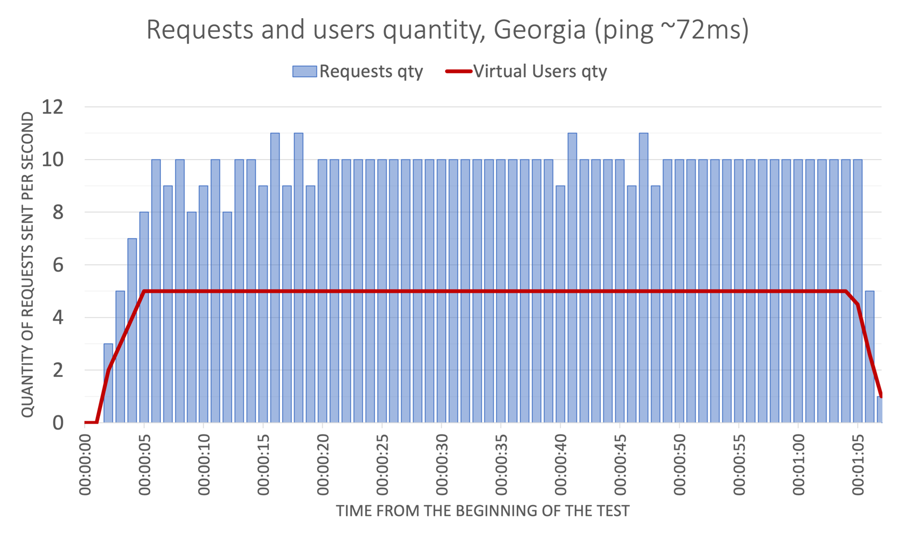
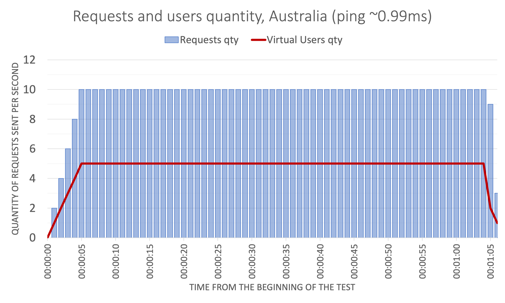
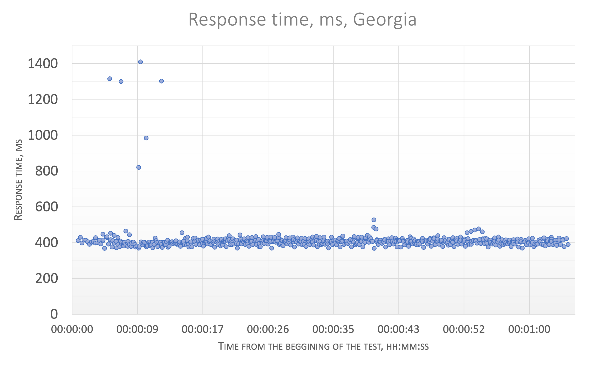
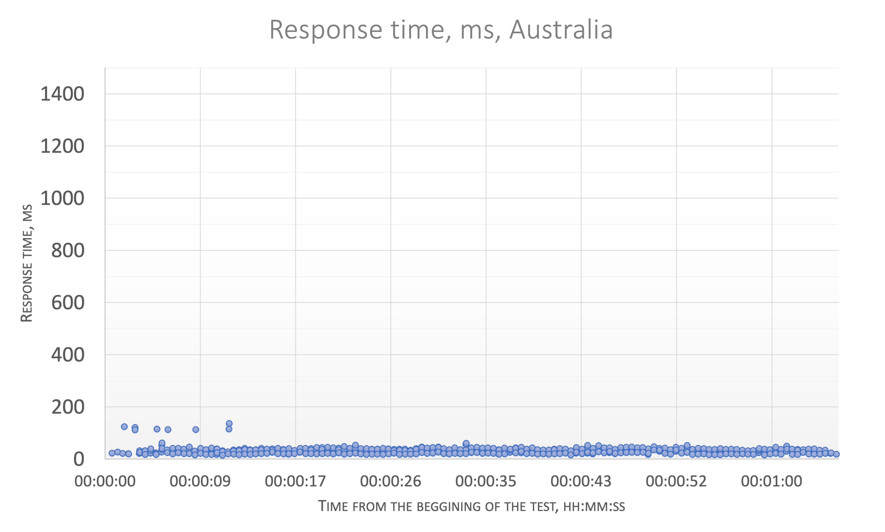
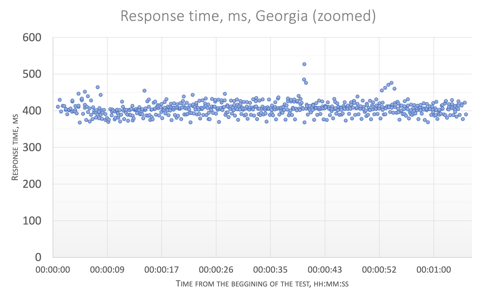
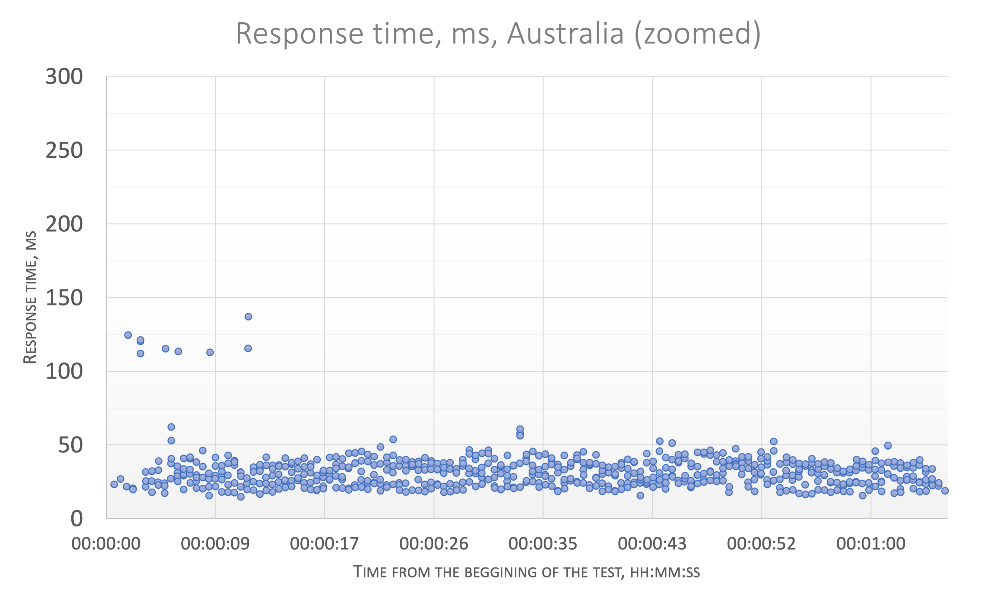
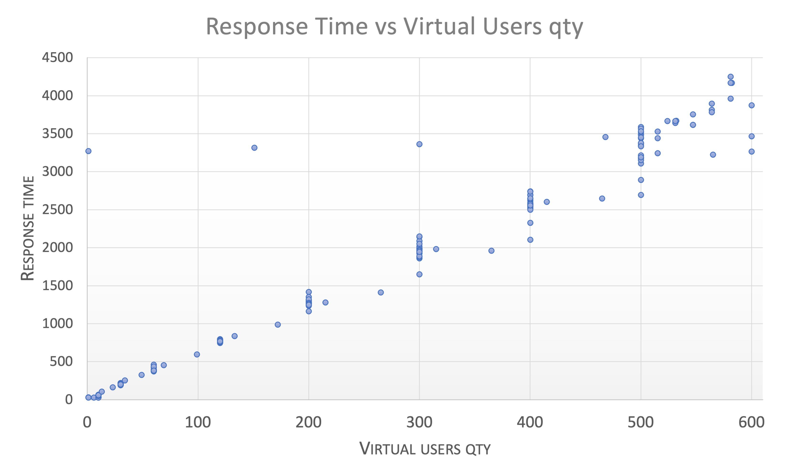
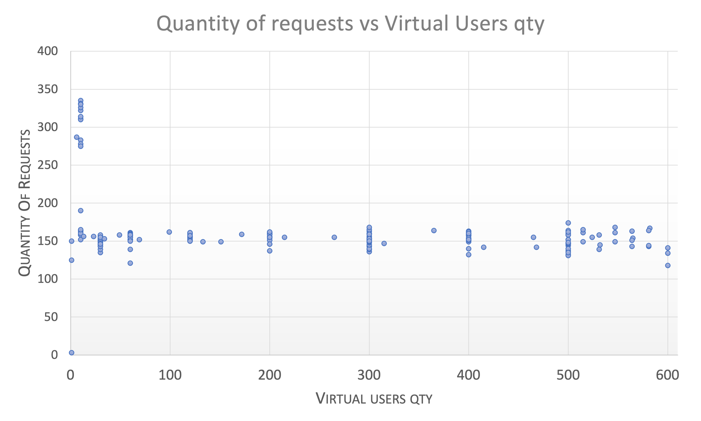
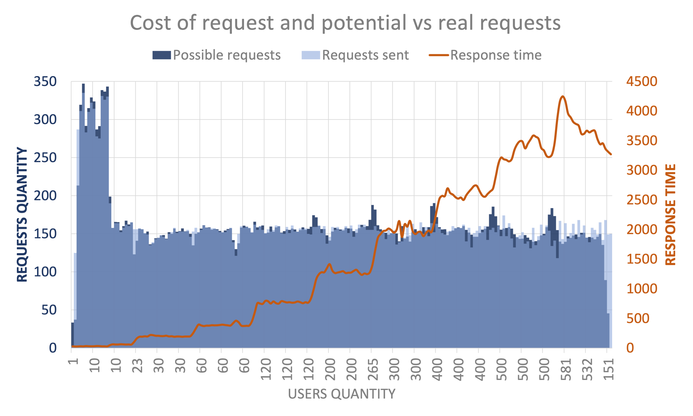

# Assurity Consulting 
Performance test as a technical assignment for Assurity Consulting.

## Table Of Contents

- [Overall description](#overall-description)
- [Installation](#installation)
- [Usage](#usage)
- [Options](#options)
- [Assumptions, constraints and implementation notes](#assumptions-constraints-and-implementation-notes)
   - [Environment](#environment)
   - [Reporting](#reporting)
   - [Tools](#tools)
- [Test design remarks](#test-design-remarks)
   - [Print Values](#print-following-values-in-a-csv-file-category-id-name-path-promotion-id-price)
   - [Test assertion](#test-assertion)
   - [Virtual users / threads concept](#virtual-users--threads-concept)
   - [Category ID mix](#category-id-mix)
   - [OK Status](#ok-status)
- [Report](#report)
   - [Test goal](#test-goal)
   - [Approach](#approach)
   - [Deliverables](#deliverables)
   - [Results](#results)
   - [Conclusions](#conclusions)
- [Known issues](#known-issues)
- [Original task listing](#original-task-listing)


# Overall description
The performance testing tool is [k6 engine](https://k6.io/) which uses **script.js** where all the options and the test code is stored.
K6 has been compiled together with [xk6-file](https://github.com/avitalique/xk6-file) extension in order to support file output.

The tool sends requests to specified URL, with a changing URL parameter and performs multiple checks on request response. 

Checks are implemented with native k6 features. Results of checks are available on finish, including validation of request status, validation of request body and validation of response time threshold.


The scenario ramps up virtual users up to required quantity and hold on for preset timeperiod, after which a graceful shutdown is made.

The detailed stats for the test session are passed to the stdout at finish. It contains a lot of info, but most important for is **http_req_duration** which is a summary of sending, waiting and recieving (i.e. full roundtrip of request). Other metrics may be found on [k6 metrics page](https://k6.io/docs/using-k6/metrics/).

Service messages on timestamp, category id and response time are thrown into console while working. You may ignore them.


All necessary code comments were put into **script.js**.

# Installation
Download **k6**, **script.js** and **res_proc.sh** and put to the folder where your user has write permissions.

# Usage
```bash
./k6 run script.js
```
The command will result in output file with the timestamp of the start in GMT, for example: _2023-03-13T22-07-43.csv_.

The CSV file contains the following data:
- Timestamp in simplified extended ISO format (GMT)
- Request response time in ms
- Data received in response from server:
    - Category ID
    - Name 
    - Path
    - All available Promotion IDs and their prices

Example:
```csv
2023-03-13T10:22:28.094Z,407.412,6329,Home & garden,/Books/Magazines/Home-garden,id:1,price:0,id:2,price:0.25,id:3,price:0.75,id:4,price:0.95
```

You can optionally use **res_proc.sh** for further results processing. Based on awk, it will read results.csv and calculate Standard Deviation, 95th and 99th Confidence Interval for each category found and for the entire data in csv file.

Usage:
```bash
./res_proc.sh [CSVFILE]

#For Example:
./res_proc.sh results.csv
```

> If there are troubles with executing res_proc as executable bash, please use '**sh res_proc.sh results.csv**' variant.

Please use k6-arm executable to run on ARM architecture.
```bash
./k6-arm run script.js
```

# Options
I have considered to put options to the command line, which will override options section in the file, but since initial requirements for options are complicated and have to be calculated, I decided that I leave options in **script.js** file, since if we want to override them from commandline, we still have to change that file. Here are the options:

| Option  | Code line | Preset value | How to change |
| ------------- | ------------- | ------------- | ------------- |
| requests per second | ```const defined_rps = 10;``` | 10 | Set to the new value |
| virtual users | ```const vu_qty = Math.floor(category_id.length / 2);``` | half the count of Category IDs (5) | Substitute calculation formula to the value or increase preset array of Category ID |

Other required options are located in k6's **options** code block of the **script.js**.
```js
export const options = {
  scenarios: {
  ...
  },
};
```
| Option  | Code line | Preset value | How to change |
| ------------- | ------------- | ------------- | ------------- |
| ramp-up time | ```{ target: vu_qty, duration: vu_qty+'s' },``` | 1 per s | Manipulate with vu_qty variable or override direct values. Note that you can add more stages |
| steady state | ```{ target: vu_qty, duration: '60s' },``` | 60s | Specify directly |
| qty of virtual users to start with | ```startVUs: 0,``` | 0 | Specify directly |
| threshold check | ```http_req_duration: ['p(90)<500.001'],``` | 90 percent of the times the API is expected to perform within 500 ms | Specify directly or add more thresholds. For metrics refer to [k6 metrics page](https://k6.io/docs/using-k6/metrics/) | 

**NB:** There might be limitations in producing load due to reponse time from the server. Please refer to [Virtual users / threads concept](#virtual-users--threads-concept) part of [Test design remarks](#test-design-remarks) section.


# Assumptions, constraints and implementation notes
Several assumptions were made for this technical assignment.

### Environment
- Please ensure that your firewall doesn't block 
  - k6.io server, as the script obtains one of the methods from https://jslib.k6.io/
  - githubusercontent.com, as the script obtains html report method from there. 
- I've tested the solution on **Ubuntu 18.04 VM (X86-64)** located in **Australia** and **MacOS Ventura 13.0 (ARM)** located in **Georgia**. Note that for other architectures you have to compile k6 + xk6-file by your own.
- Since the system under test has a .co.nz domain, I though it would be reasonable to execute the test not only from Georgia, which is quite far geographically, but also from as close location as possible to save time on receiving data. So, one bulk of results were obtained from **Georgia** (ping **~70ms**) and another bulk from **Australia** (ping **~0.99ms** - probably your server is located in the same datacenter ;-)).

### Reporting
As github markdown doesn't allow complex constructions or makes them much harder to inject I cut some details from report in markdown file making explanations shorter and provide them in additional report:

report.html

>"I have discovered a truly marvelous proof of this, which this margin is too narrow to contain." **Pierre de Fermat**, **1621**

### Tools
I have used Excel to build charts and perform some of analysis. Of course it would make much easier to automate some this kind of work with let's say, R package, however I decided that it would be much quicker to get what I want.

Another important remark is that quantity of data we receive during the test is relatively small and thus we are able to visualize it entirely. If we have 5-10k points in our test, visualizing it blindly won't give us a thing - we just won't see anything on chart. In such a case aggregation and/or special analysis technics such as regression models, results distribution and so on. 

# Test design remarks
I feel that some of the test design specifications provided may be treated different ways and I would like to take a moment to highlight those.

### Print following values in a csv file: Category ID, Name, Path, Promotion ID, Price

It's not clear if this CSV file should contain requested fields **only** or additional info, such as timestamp and response time, can be added. If I am to implement requirements "as is", there should be this file and another file with other data I want to collect. It seems to be an overkill a bit, so I forced myself to read that requirement as "at least" and included other necessary info into output CSV.

### Test assertion

It's not clear from the description if the requests with 2XX response but not passing two other criterias, should be considered as wrong and thrown out of results. Based on my experience, developers can both reject these requests from report ('these are erroneous and we don't need them for analysis') and accept them ('server spends time processing them nevertheless')

Based on the responses, I supposed that everything with the 2XX code has processed correctly by the server and is of interest for the test results.

### Virtual users / threads concept

For a lot of performance testing tools virtual user is a concept equal to thread. It means that a VU is limited by 1/(RT) requests per second, where RT is average response time from server including downloading the response. Thread cannot issue new request until he is waiting for an answer. In order to make fixed quantity of requests not depending on response wait, we have to use more than one thread per VU, e.g. if VU has to send 2 requests per second, second thread will be sending the request in scheduled time even if first thread waits for the server's reply for 1.5s. 

K6 has this limitation, too, so if server is replying slowly, K6 simply could not reach necessary requests per second with insufficient quantity of free VUs. In our conditions with the requirement of 5 VUs and requirement of 10 requests per sec, server should reply in less than 500ms so we can accomodate necessary rate.

In a case when slow response delays us, a message ```'probably there is not enough vu to produce necessary rate'``` will be thrown into console.

I **strongly** believe that a good tool must control both rate and vu at the same time, but since k6 is unable to do so, I've added calculation of the request delay. It will work while vu quantity is enough, including the case when server's response is long; if the server's response is too long to produce necessary rate, vu will try to produce them as fast as it could.

### Category ID mix

There is a selection of Category IDs, which should be used for the request. Generally speaking, they could be separate test cases, since they can trigger different parts of the code, subsystems, db procedures and tables, and so by default, without system knowledge, I would consider them as that.

There is no instructions on if we should use special mix of test cases, use randomly selecting those or calling consequently. Based on the responses I decided that I will consider all requests equal and call them randomly; while quantity of requests during the test is relatively big, we can expect near equal quantity of each request in the entire population.

### OK Status

Assertion requirements doesn't specify what is 'successful' response. In such a case I am considering that any of 2XX code is considered as successful request and check for that.

# Report
## Test goal
Test the API of the server to ensure that 90% of requests fall into 500ms threshold.
## Approach
Total quantity of users that will be used is half of the list of categories ID provided (that is 5 according to the quantity of Category ID)
- Test will ramp up starting with **0 vu** with speed of **1 vu per second** until it reaches target quantity (**5** seconds). 
- After ramping up test will produce **10** requests per second during **60** seconds.
- The test will gracefully shut down its activities during **1-2** seconds.
Test will **randomly** select Category ID from the provided list.
Each response will be checked according to the provided rules.
Threshold will checked by the tool on finish.
## Deliverables
- CSV file with **Timestamp**, **Response time**, **Category ID**, **Name**, **Path**, **Promotion ID**, **Price**
- Statistics of checks done and output from the tool in **.html** format.
- Additional statistics for the experiments: **Standard Deviation** and **Confidence Interval**
## Results
### Checks
All checks were passed, except CanRelist=true, which has different pass rate for different locations. This is related to final quantity of requests to CategoryID 6331 in the mix, which is the single one that has CanRelist=false parameter.
| | Georgia | Australia |
| --- | --- | --- |
| OK responses | 100% | 1005 |
| CanRelist=true? | 555 of 621 (85%) | 573 of 632 (90%)|
| is CategoryId proper? | 100% | 100% |
| Treshold | 426.57 (passed) | 41.79 (passed) |

### Users allocation and request quantity
It is seen that while test has been executed from Australian data center, more accurate rate per second has been produced. This is related to the higher response time issue, which I am discussing in [Virtual users / threads concept](#virtual-users--threads-concept) part of [Test design remarks](#test-design-remarks) section. Nevertheless, Australian part works fine.
| Georgia | Australia |
| --- | --- |
|  |  |
### Response time
Total quantity of requests is different between Georgia and Australia. This is related to the fact that some request were long in time and there were not enough virtual users to issue proper rps. Once again, please refer to [Virtual users / threads concept](#virtual-users--threads-concept) ;-).
| | Georgia | Australia |
| --- | --- | --- |
| Maximum response time, ms | 1409.71 | 137.07 |
| Median response time, ms | 405.79 | 30.94 |
| 95p response time, ms | 432.32 | 45.33 |
| Quantity | 621 | 632 |

We see that reponse time collected from Georgia is much higher comparing to the Australia with much worse outliers in the beginning of the test reaching almost 1.5 seconds. This is related to the distance between server and Georgia (much higher ping). We can see outstanding difference in the same chart zoom.
| Georgia | Australia |
| --- | --- |
|  |  |

If we zoom our charts a bit, we would be able to see deviation of the results.
Here we must note the following:
- there is **no significant trend** for results to be better or worse during our observation (but can't actually say if it doesn't exist at all).
- there are outliers for Australian stats, too and these are also around 3 times more than average response time. This might be related to the tool, but I didn't find any evidence of that.
- quantity of outliers is small, system under test behaves stable; deviation of response time is not changing over time and is relatively small.

| Georgia | Australia |
| --- | --- |
|  |  |
### More stats
I personally prefer to use confidence interval (aka CI) to use for the results processing. There are three reasons for that:
- Confidence interval is very convinient to understand: it is an interval in which reponse will fall with a certain level of probability.
- While comparing two result sets, we can substract one interval from other and if the result will contain 0, then we can conclude that samples are equal
- It's also very cool to illustrate graphically. For example :

So I've calculated these stats for our experiments:

| | Georgia | Australia |
| --- | --- | --- |
| Mean, ms | 413.17 | 32.11 |
| Standard deviation, ms | 81.22 | 13.26 |
| 99th Confidence Interval, ms | \[404.77;421.58] | \[30.75;33.48] |

The most interesting thing to check here if confidence intervals for different categories are different. I've discussed this in [Category ID mix](#category-id-mix) part of [Test design remarks](#test-design-remarks) section. Table below is a cut from full table available in full report.

| Category ID | 99th CI, Georgia | | 99th CI, Australia |
| --- | :---: | --- | :---: |
| 6327 | \[388.68;458.22] | |  \[27.65;37.09] |
| 6328 | \[401.89;411.39] | | \[31.05;36.73] |
| 6329 | \[403.47;414.33] | | \[27.61;32.83] |
| ... | ... | | ... |

From what we see, CI differs in different category id. I was interested if the data is **statistically different** or jittering numbers are just some noise? This can be explained with ANOVA (Analysis Of Variance).
### ANOVA
In a nutshell, ANOVA is to calculate square sum between groups, divide it by square sum within groups and compare with pre-defined coefficient. If pre-defined coefficient is more than calculated, then there is no difference between groups, and what we see is just noise. In other words, null hypothesis is accepted.

There's pretty much of calculations to be done, I will omit algorithm in order not to mess around already mammoth document. These calculations may be programmed or taken from standard analysis packages of any tool like Python or R. I've calculated that in Excel.

Here is **ANOVA** for **Georgian** results:

| | Square Sum | Degrees of freedom | Mean Square Sum | F | F<sub>predefined</sub> |
| --- | ---: | :---: | --- | --- | --- |
| Between groups | 74407,68| 9 | 8267,52 | 1,25556473 | 1,89519036 | 
| Within groups | 4023253,26 | 611 | 6584,70 | | |

**F < F<sub>predefined</sub>**, it means that null hypothesis is accepted. It means groups **are equal** and what we see as difference in response time between different Category ID is explained by the random noise.

Let's do the same for **Australian** results:

| | Square Sum | Degrees of freedom | Mean Square Sum | F | F<sub>predefined</sub> |
| --- | ---: | :---: | --- | --- | --- |
| Between groups | 2378,28| 9 | 264,25 | 1,50170851 | 1,89491893 | 
| Within groups | 109452,32 | 622 | 175,97	 | | |

**F < F<sub>predefined</sub>**, it means that null hypothesis is accepted. It means Australian groups are equal too and what we see as difference in response time between different Category ID is explained by the random noise. 
### And one more thing...
I was quite insterested in how server behaves under uncontrolled flood of requests and made couple of extra experiments.
The experiment was designed in a simple ramp up with with requests falling to server as much as vu can (according to the response time), i.e. there are no delays implemented and thus vu are only limited by the speed of the server. I've included several stages starting from 10 and up to 600 vu. This is being done from **Australia location** to minimize all possible delays.

Here are things I've found.

|   |  |
| --- | --- |

Quantity of requests is not growing during the test, though we increase quantity of vus. This may be related to the kind of throttling, when server rejects requests above maximum threshold, but I **didn't** receive just **any non-200xx** response, meaning **all** requests are being **fairly processed**. Also, metrics of **http_req_blocked**, **http_req_connecting**, **http_req_tls_handshaking** are not growing significantly staying inside **dozens of microseconds**, meaning that we don't experience significant delays in sending requests. At the same time the more vus are initialized the more response time degradation is observed. This is most probably due to requests are being put into server's queue for processing. If we return to [Virtual users / threads concept](#virtual-users--threads-concept) (oooph, once again :)), we can calculate how much requests we can potentially make based on server's response. It will be:


This formula means that if vu quantity producing load progresses as fast as response time increase, then theoretical throughput will be constant. That is confirmed by the following chart with calculated and real throughput.



At the same time we may notice that during first 10 minutes, server handled spike of 300 rps. This may be related to some maintenance with the server at the moment, some workload from others absense or clever mechanism of throttling, when everything which is coming from the same IP massively is being put to the queue. Also, it may be some other people DDoSing this server at the same time and I just don't know it. I need to note here that if we were not able to reach that level once again, it may be considered as some anomaly and should be investigated.

I've repeated experiment with only two levels of 10 and 20 vus and got **the same** constant **~150 rps** with response time increase from **~60ms** to **~120ms** after vu increase. 

During these experiments I found that a VM with 512 MB of RAM and 1 CPU can successfully handle no more than **150-170** vus running. With more it starts swaping and unpleasantly hangs.

### Conclusions
- Provided server is able to handle **10 rps** by vus within provided threshold of **500ms**, even when the client is far away from the server. We should note that **70ms** to server is practically maximum ping which will allow to stay within given the threshold.
- Categories with **id = 6331** always fail functional check **CanRelist=true**, since their param is CanRelist=false.
- Response time for different categories **doesn't statistically differ** from each other.
- Maximum found fair throughput of the API server seems to lie **around 150 rps**.
- VM of **1 CPU / 512 RAM** can handle around **150-170 vus** with simple load as in requirements. VM of **2 CPU / 4 GB RAM** can handle at least **600** vus.

### Formal raw results
Right-click and save as.

| Georgia | Australia |
| --- | --- |
|  [html](report_georgia/report.html) | [html](report_australia/report.html)|
| [2023-03-13T17-28-09.csv](https://raw.githubusercontent.com/forkintheass/assurity/main/report_georgia/2023-03-13T17-28-09.csv)|[2023-03-13T22-07-43.csv](https://raw.githubusercontent.com/forkintheass/assurity/main/report_australia/2023-03-13T22-07-43.csv) |

# Known issues

**Output file**

I found that name pattern that I used, can lead to multiple files created and written to. This happens if (when) the engine cannot initiate virtual users quick enough and thus each initiation takes next timestamp, for example, just 1 millisecond forward, as filename based to the code. I reported that [issue](https://github.com/avitalique/xk6-file/issues/6) for the [xk6-file](https://github.com/avitalique/xk6-file) mod developer's consideration since it may be a feature of k6. As a workaround I cut the milliseconds from the generated timestamp, however I found some cases when even this one can bring multiple files - if the engine initiates 500+ virtual users, it can take more than 1 second.

**Ids and prices in the output file**

I believe that final output file should be in a standard form of a csv, since we actually don't know how many ids and prices can be returned in JSON. Yes, it's 0 or 4 in our case, but it should not be taken for granted. Thus, resulting csv file should have the same amount of fields in each line, with empty values in case promotion id is absent. 

I.e. instead of the following
```csv
21:00:11,340.23,6330,id:1,price:0.75,id:2,price:0.95,id:3,price:0.85,id:4,price:1.55
21:00:11,256.12,6331
```
we should have
```csv
21:00:11,340.23,6330,id:1,price:0.75,id:2,price:0.95,id:3,price:0.85,id:4,price:1.55
21:00:11,256.12,6331,,,,,,,,
```
This approach requires to re-parse written file, however I found that k6 engine cannot read file in any stage but initialization. I tried to created a re-parser by awk but I didn't have enough time to finish.

## Original task listing

**Functional Requirements:**
- API: https://api.tmsandbox.co.nz/v1/Categories/6327/Details.json?catalogue=false 
- Test Data: (Category ID: 6327, 6328, 6329, 6330, 6331, 6332, 6333, 6334, 6335, 6336)

**Test Assertion:**
- Check for the Response Status
- On a successful response, validate the response with below criteria:
- Parameter Check: Category ID
- Text Check: "CanRelist": true
- Print following values in a csv file: Category ID, Name, Path, Promotion ID, Price
- Please print all Promotion IDs and respective Prices per Category ID

**Non-Functional Requirements**
- NFR-01 Test should support Vusers (Threads) half the count of Category IDs shared in Test Data
- NFR-02 The test should ramp up at one VUser (Thread) per second
- NFR-03 Test should achieve 10 API calls in total for the 1-minute Steady State duration
- NFR-04 90 percent of the times the API is expected to perform within 500 ms

**Performance Test Execution:**
- The test execution parameters should allow for changing ramp-up, steady state, throughput and VUser (Thread) count.

**Performance Test Reporting:**
Prepare a performance test report explaining the purpose, observations you made from your local runs, and other commentary as you deem fit.

**Instructions:**
- Ensure you include a clear ReadMe (markdown file in source repo) for all the steps that lets us execute and review the script and any supporting files. (It must be submitted in a public repository like Bitbucket or GitHub)
- Make sure any assumptions made are included in the ReadMe file.
- Your test must meet all the requirements specified

**Scripting:**
- API call can be made using any open-source performance test tool of your choice
- Test Assertion must be written code in a scripting language of your choice, but compatible with the performance test tool selected.

**Performance Test Reporting:**
- Test executions carried out by you & the instructions you share should be for a non-GUI test run if the tool supports it.

**Performance Test Report:**
- Attach the test raw data file in the source repo.
- The report should be written in ReadMe (markdown file in source repo).
- The report should include the commentary and supporting evidence where applicable.
- Additional report formats can be added for reference to the source repo (Non inclusion of additional formats will not lead to negative marking, however, will be given points for the effort if included)
- Points will be awarded for meeting the criteria, style and the use of good practices and appropriate use of source control.
We want to see your best work - no lazy coding or comments.
